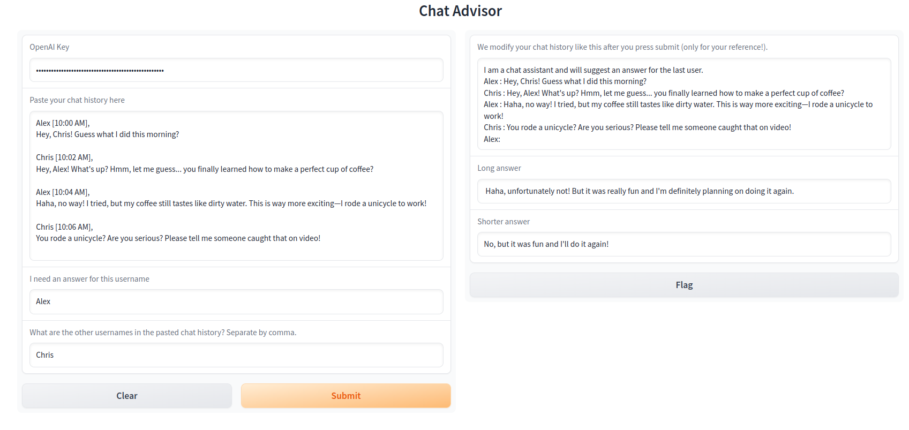

[](https://opensource.org/licenses/MIT)
[](https://github.com/FzS92/ChatAdvisor/actions/workflows/python-app.yml)
[](https://github.com/FzS92/ChatAdvisor/actions/workflows/python-package.yml)

# Chat Advisor
This is a Python application that uses ChatGPT to generate suggested answers for a given chat history. It takes input in the form of a chat history and user information, and provides two types of answers: a longer answer and a shorter answer.

The code for this project is also published on HuggingFace Space. You can access the web interface and try out the Chat Advisor by visiting the following link:

[HuggingFace Space: Chat Advisor](https://huggingface.co/spaces/fzs/ChatAdvisor)


## Installation

1. Clone the repository and go to the downloaded file:

```python
git clone https://github.com/FzS92/ChatAdvisor.git
```

2. Install the required dependencies:
```python
pip install -r requirements.txt
```
3. Obtain an OpenAI API key. You can sign up for an account and obtain the key from the [OpenAI website](https://platform.openai.com/account/billing/overview).

## Usage
1. Run the application:
```python
python app.py
```

2. The application will launch a web interface where you can input the necessary information.

3. Provide the OpenAI API key, paste the chat history, enter your username, and specify the other usernames in the chat history (separated by commas).

4. Click the "Submit" button to generate the suggested answers.

5. The generated answers will be displayed in the web interface.



## HuggingFace Space
The code for this project is also published on HuggingFace Space. You can access the web interface and try out the Chat Advisor by visiting the following link:

[HuggingFace Space: Chat Advisor](https://huggingface.co/spaces/fzs/ChatAdvisor)

## Acknowledgments
The application uses the [ChatGPT-OpenAI](https://openai.com/) API to generate suggested answers.
